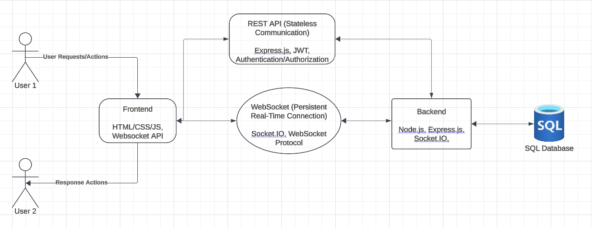
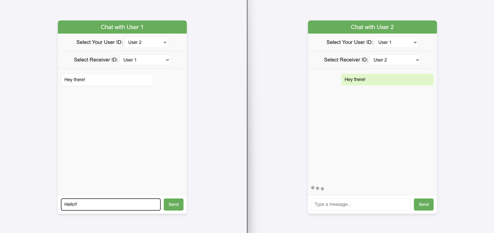

# Overview
This project is a work in progress. I'm designing this to expand my understanding of real-time messaging and user authentication. Updates and improvements will continue as I expand its features and refine functionality.

The end goal of this project is to create a real-time messaging platform with secure user authentication. I'll be leveraging WebSocket for persistent connections and a REST API for stateless communication. 

This is a system design diagram for the project:

# Image
